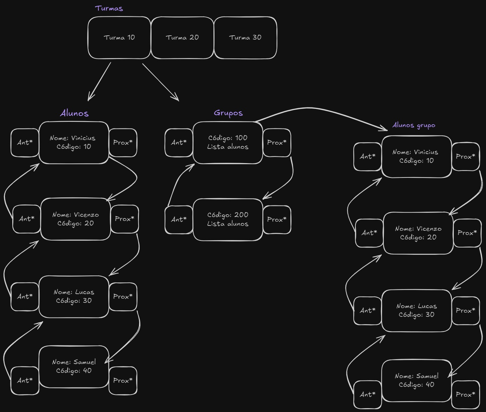

# Sistema de Gerenciamento de Turmas, Alunos e Grupos

Este é um sistema simples em linguagem C para gerenciamento de turmas, alunos e grupos. O objetivo principal é treinar a implementação e manipulação de listas encadeadas, permitindo o cadastro, consulta e exclusão de turmas, bem como o gerenciamento de alunos associados e a criação de grupos de trabalho com base nessas turmas.

## Como funciona

1. **Cadastro de Turmas**

    - O usuário informa um código para a nova turma.
    - A turma é armazenada em memória dinâmica e adicionada à lista de turmas.

2. **Remoção de Turmas**

    - O usuário informa o código da turma a ser removida.
    - A turma e todos os dados associados (alunos e grupos) são removidos da memória.

3. **Listagem de Turmas**

    - Exibe todos os códigos das turmas cadastradas até o momento.

4. **Cadastro de Alunos**

    - O usuário informa o código da turma, o código do aluno e o seu nome.
    - O aluno é adicionado à lista da turma especificada.

5. **Remoção de Alunos**

    - O usuário informa o código da turma e o código do aluno.
    - O aluno é removido da memória.

6. **Listagem de Alunos**

    - O usuário informa o código da turma.
    - Exibe os nomes dos alunos cadastrados em uma turma específica.

7. **Criação de Grupos**

    - O usuário informa o código da turma e o código do grupo a ser criado.
    - O grupo é adicionado à lista de grupos da turma.

8. **Remoção de Grupos**

    - O usuário informa o código da turma e o código do grupo a ser removido.
    - O grupo e a lista de alunos vinculado a ele é removido da memória.

9. **Listagem de Grupos**

    - O usuário informa o código da turma.
    - Exibe todos os grupos formados dentro de uma turma.

10. **Incluir Aluno em um Grupo**

    - O usuário informa o código da turma, o código do grupo e o código do aluno.
    - O aluno é adicionado ao grupo especificado dentro da turma.

11. **Remover Aluno de um Grupo**

    - O usuário informa o código da turma, o código do grupo e o código do aluno.
    - O aluno é removido do grupo especificado dentro da turma.

12. **Consultar Alunos dos Grupos**

    - O usuário informa o código da turma.
    - Exibe todos os alunos de todos os grupos dentro de uma turma.

13. **Listar Alunos sem Grupo**

    - O usuário informa o código da turma.
    - Exibe os alunos de uma turma que não estão alocados a nenhum grupo.

14. **Listar Alunos em Mais de Uma Turma**

    - Exibe os alunos que estão matriculados em mais de uma turma.

15. **Listar Alunos em Apenas Uma Turma**

    - Exibe os alunos que estão matriculados em apenas uma turma.

## Estrutura de Dados

-   Utiliza array para armazenar:
    -   Turmas
-   Utiliza listas encadeadas para armazenar:
    -   Alunos de cada turma
    -   Grupos dentro de cada turma

## Visualização da Estrutura

